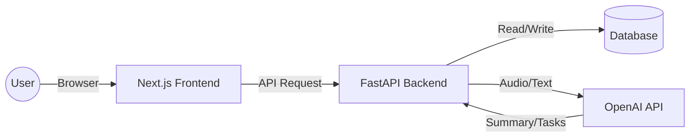

# Lab DX Platform - 研究室・学生寮運営支援プラットフォーム


>  DXプラットフォーム

## 概要 (Overview)

研究室や学生寮の運営における作業の効率化を目指して開発しました。
単なる管理ツールではなく、「毎日触りたくなるUI/UX」と「実用的なAI活用」の両立を目指したプロダクトです。

## 開発の背景 (Background)

私が所属する組織では、以下の2点が常態化した課題となっていました。

1.  議事録が活用されない: 会議の録音やメモは残るものの、誰も見返さないデータになっており、ネクストアクションが曖昧なまま終わることが多かった。
2.  タスク管理のモチベーション不足: 「誰かがやるだろう」という空気が流れ、事務的なタスクほど放置されがちだった。

## こだわったポイント (Key Features & UX)

### 1. 「会議」から「タスク」への直通ライン（AI活用）
OpenAI API (Whisper + GPT-4o-mini) を活用。会議の音声をアップロードするだけで「文字起こし」「要約」「タスクの自動抽出」を一気通貫で行います。
特に、AIが抽出した「やるべきこと（Action Items）」をワンクリックでカンバンボードに追加できる機能を実装し、議事録作成からタスク化までの工数を大幅に削減しました。

### 2. 触り心地の良さ
ツールへの愛着を持ってもらうため、操作感（Juiciness）を徹底的に作り込みました。
* 物理的なフィードバック: ボタンを押した時の沈み込みや、タスクを掴んだ時の挙動。
* 達成感の演出: タスク完了時に「紙吹雪」が舞い、心地よい効果音が鳴ることで、事務作業に小さな報酬を与えています。
* シームレスな操作: `dnd-kit` を採用し、ストレスのないドラッグ&ドロップを実現しました。

### 3. UI/UXの勉強がしたかったので遊びごころで実装しました。
タスクを消化すると経験値（EXP）が貯まり、ユーザーのレベルや称号が上がります。
「作業」を「クエスト」に見立てました。

## 🛠 使用技術 (Tech Stack)

### Frontend
* Next.js 14 (App Router): パフォーマンスと開発効率を重視して採用。
* TypeScript: 型安全性による保守性の向上のため。
* Tailwind CSS: スピーディなスタイリングとデザインの統一のため。
* UI Libraries: Framer Motion (アニメーション), dnd-kit (DnD), React Hot Toast (通知)

### Backend
* FastAPI (Python): 非同期処理によるパフォーマンスと、AIライブラリ（Pythonエコシステム）との親和性を考慮して採用。
* SQLAlchemy + SQLite: 迅速な開発のためSQLiteを採用（本番環境ではPostgreSQLへの移行を想定）。
* OpenAI API: 音声認識(Whisper)と自然言語処理(GPT models)に使用。

## システム構成図 (Architecture)



## 起動手順 (How to run)

### 1. Clone
```bash
git clone [https://github.com/YOUR_USERNAME/lab-dx-platform.git](https://github.com/YOUR_USERNAME/lab-dx-platform.git)
cd lab-dx-platform
```

### 2. Backend Setup
```bash
cd backend
python -m venv venv

# Windows
.\venv\Scripts\activate
# Mac/Linux
source venv/bin/activate

pip install -r requirements.txt
```

環境変数の設定:
`backend` ディレクトリに `.env` ファイルを作成し、APIキーを設定してください。
```env
OPENAI_API_KEY=""
```

### 3. Frontend Setup
別のターミナルを開き、フロントエンドのディレクトリで実行してください。
```bash
cd frontend  # ルートからの場合: cd code/lab-dx-platform/frontend
npm install
```

### 4. Start Application

Backend:
```bash
# backendディレクトリで実行
uvicorn main:app --reload
```

Frontend:
```bash
# frontendディレクトリで実行
npm run dev
```
ブラウザで `http://localhost:3000` にアクセスしてください。

## 今後の展望 (Roadmap)

* デプロイ: FrontendをVercel、BackendをRender.comへデプロイし、常時稼働させる。
* 認証機能: Firebase Authを導入し、ユーザーごとのデータ管理を行う。
* モバイル対応: スマホからもタスク確認ができるようレスポンシブデザインを調整する。

---
Created by [Satoshi Kinoshita]